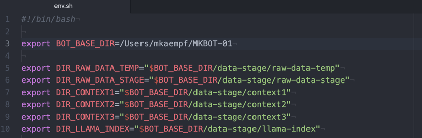
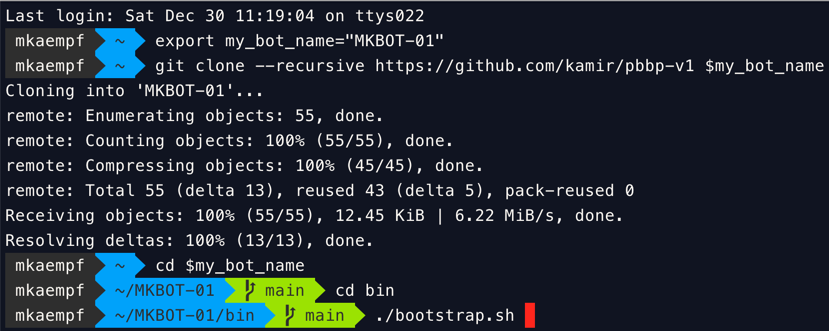

# pbbp-v1
Personal Bot Blueprint - verion 1.0

This is a very generic project for keeping the parts of an evolving personal bot ecosystem together.

## Step 1

Prepare a personal branch of your BOT-PoC environment using a Github repository with a bluepring project, and several submodules.

This branch of the blueprint project becomes the home of your personal configurations and the data files your bot works with.

It is recommended that you create a fork of the project: **https://github.com/kamir/pbbp-v1** and use this as a starting point, especially in a later stage of the project, when you start working with personal data.
Working on a forked repository allows you to keep private data under your exclusive controle.

```
export my_bot_name="MKBOT-01"
export my_branch="phase-1"

(optionally) fork this repo: https://github.com/kamir/pbbp-v1

git clone --recursive https://github.com/kamir/pbbp-v1 $my_bot_name
cd $my_bot_name
git branch $my_branch
git checkout $my_branch
cd bin
```

## Step 2
Configure the **BOT_BASE_DIR** environment variable, the paths, and the API keys in _**cfg/env.sh**_.



## Step 3

Configure the Python environment in _**assistent/init-venv-dev.h**_ and in _**bin/init-venv.h**_

This allows us to switch between a well working virtual environment and one for development activities.

## Step 4
Run _**bootstrap.sh**_.



