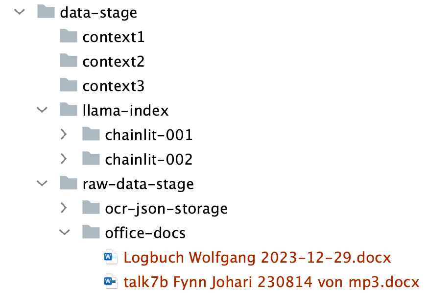
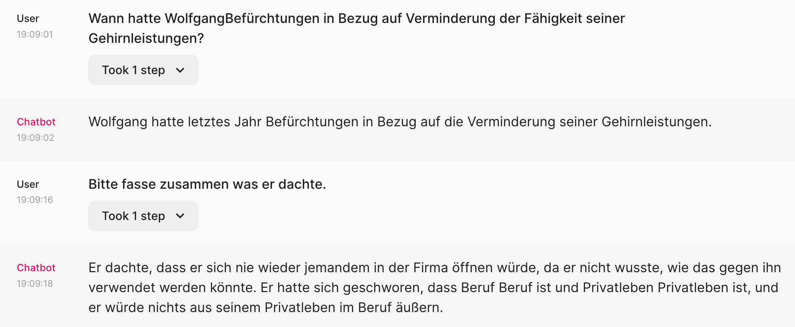

## Nutzung von 2 individuallen Index-Strukturen

### Datenbasis

Mit diesen Dateien befragen wir das System, nach einer speziellen im Logbuch erwähnten Thematik.

*Frage 1:* Wann hatte WolfgangBefürchtungen in Bezug auf Verminderung der Fähigkeit seiner
Gehirnleistungen?

*Frage 2:* Bitte fasse zusammen was er dachte.

### Resultat

